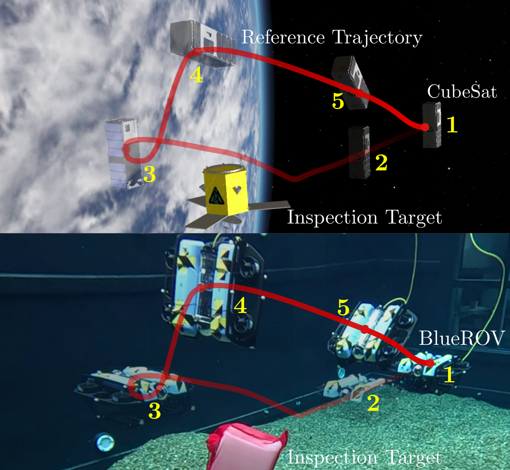

# space_validation: 
**Validation of Space Robotics in Underwater Environments via Disturbance Robustness Equivalency.**

This is the code accompanying the paper in which we present an experimental validation framework for space robotics that leverages underwater environments to approximate microgravity dynamics. 
While neutral buoyancy conditions make underwater robotics an excellent platform for space robotics validation, there are still dynamical and environmental differences that need to be overcome. 
Given a high-level space mission specification, expressed in terms of a Signal Temporal Logic specification, we overcome these differences via the notion of *maximal disturbance robustness* of the mission. We formulate the motion planning problem such that the original space mission and the validation mission achieve the same disturbance robustness degree.
The validation platform then executes its mission plan using a near-identical control strategy to the space mission where the closed-loop controller considers the spacecraft dynamics.
Evaluating our validation framework relies on estimating disturbances during execution and comparing them to the disturbance robustness degree, providing practical evidence of operation in the space environment.
Our evaluation features a dual-experiment setup: an underwater robot operating under near-neutral buoyancy conditions to validate the planning and control strategy of either an experimental planar spacecraft platform or a CubeSat in a high-fidelity space dynamics simulator.



## External Requirements
- Planner: create a python environment using the `environment.yml` file. Solving the planner requires a Gurobi license, which can be freely obtained for academic users.
- Control: the MPC control node relies on ROS 2 Humble and the acados optimization library. The robots (in SITL and hardware) rely on the PX4-Autopilot firmware and the micro-ROS agent for ROS 2 communication. 

## Workspace setup
Create a new ROS 2 workspace and clone this repo plus px4-offboard inside it.

```bash
mkdir -p ~/space_validation_ws/src
cd ~/space_validation_ws/src
git clone <this_repo_url> space_validation
git clone https://github.com/joris997/px4-offboard
```

Initialize submodules for this repo (this gets the BlueROV dynamics model in the correct place):

```bash
cd ~/space_validation_ws/src/space_validation
git submodule update --init --recursive
```

### Install PX4-Autopilot
Follow the official PX4-Autopilot installation instructions and keep all defaults. Also ensure to create a ros2 workspace of the px4_msgs package and build it. Add the `install/setup.bash` to the `.bashrc` file and be sure to export `PX4_SPACE_SYSTEMS_DIR`.

### Install acados
Follow the official acados installation instructions and keep all defaults
(default options, default build type, default dependencies). Be sure to update the `LD_LIBRARY_PATH` in the `.bashrc` file to include the path to the acados library.

## BlueROV setup
Ensure the BlueROV is equiped with a PX4 FMU v6x and that the micro-ROS agent is running on the same network as the BlueROV. Flash the BlueROV with the px4_fmu-v6x_uuv firmware.

1. In `PX4-Autopilot`, run `PX4_UXRCE_DDS_NS=snap make px4_sitl_uuv gz_uuv_bluerov2_heavy`
2. Start microros: `micro-xrce-dds-agent udp4 -p 8888`

Flashing BlueROV px4: `PX4_UXRCE_DDS_NS=itrl_rov_1 make px4_fmu-v6x_uuv upload` given that the BlueROV is connected to the computer via USB.

Then create a second workspace `utils_ws` for the BlueROV2 utilities. Most importantly, we run the motion capture node locally:

```bash
mkdir -p ~/utils_ws/src
cd ~/utils_ws/src
git clone git@github.com:smarc-project/motion_capture_system.git
git clone git@github.com:DISCOWER/discower_launch.git
git clone git@github.com:DISCOWER/bluerov_launch.git
git clone git@github.com:DISCOWER/srl_vehicle_mocap_odom.git
cd ~/utils_ws
colcon build --symlink-install
source install/setup.bash
``` 
And add the source command to the `.bashrc` file.

## ATMOS setup
We refer to https://atmos.discower.io/ for the latest instructions on how to set up ATMOS. 
If you're on hardware, everything should be good to go.

For SITL, you can run the following command to start the simulator:

```bash
PX4_UXRCE_DDS_NS=snap make px4_sitl_spacecraft gz_atmos
micro-xrce-dds-agent udp4 -p 8888
./startQGC
```

## Running the planner
The planner lives in the Planning package. Run it from the workspace so it can
access configuration and solution files.

```bash
cd ~/space_validation_ws/src/space_validation
conda activate space_validation
python3 -m space_validation.Planning.main
```

You can add new scenarios after which all results are dumped into the `Planning/solutions` folder. 
In order for the controller to later use these solutions, create a new subfolder in `Planning/solutions` with the name of the experiment (e.g., `exp_3`) and move the generated solution file into that folder!

## Running the ROS 2 node
Build the workspace and launch the MPC control node.

```bash
cd ~/space_validation_ws
colcon build --symlink-install
source install/setup.bash
```

Now we decide which experiment to run. Please take a look at the launch files in `space_validation/space_validation/Launch` to see how we enable Feedback Equivalence Control and Offset-Free MPC.

First determine whether you want to run in sitl or hardware

```bash
# For SITL
ros2 launch space_validation sitl.launch.py
# For hardware
ros2 launch space_validation hardware.launch.py
```

Now determine whether you want to run the spacecraft or underwater experiment

```bash
# For spacecraft
ros2 launch space_validation space_mpc.launch.py
# For underwater
ros2 launch space_validation subsea_mpc.launch.py
```


